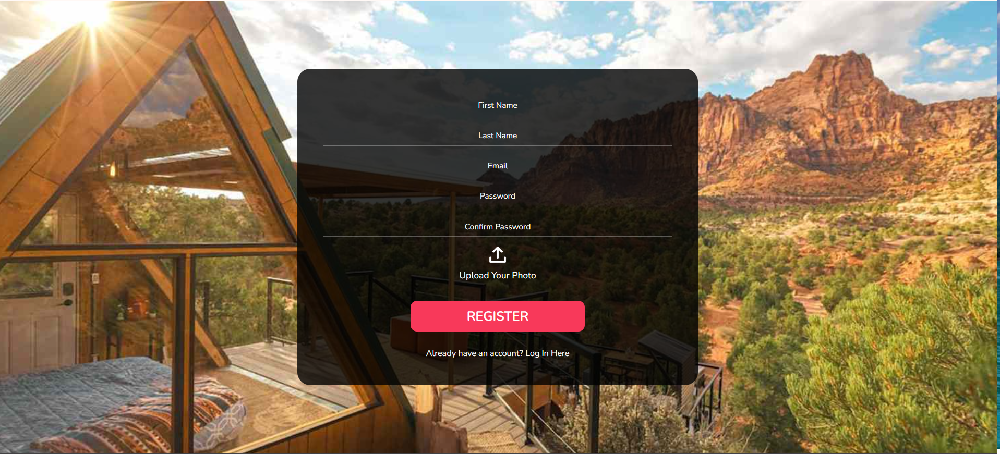

# Home-rentals-Application

The Home Rental Application is a web platform that allows users to search, book, and manage rental properties. The application features a user-friendly interface for property owners to list their properties and for tenants to find their ideal homes. It also includes a chatbot powered by OpenAI API for assisting users with queries.


## Features

- Property listing and management for owners
- Advanced search filters for tenants

- Booking and payment processing
- Integrated chatbot for user support
- User authentication and profile management


## Tech Stack

**Frontend**: React, Bootstrap, HTML, CSS

**Backend**: Node.js, Express.js

**Database**: MongoDB

**Authentication**: JWT, OAuth

**APIs**: OpenAI API (for chatbot)

**Hosting**: Render


## Installation

Install my-project with npm

```bash
    # Clone the repository
    git clone https://github.com/your-username/home-rental-app.git

    # Navigate to the project directory
    cd home-rental-app

    # Install dependencies
    npm install

    # Start the development server
    npm start
```
    
## Usage/Examples

### Accessing the Application
You can access the Home Rental Application by visiting the following URL:
[https://home-rentals-application-frontend.onrender.com/](https://your-app-url.com](https://home-rentals-application-frontend.onrender.com/))

Alternatively, you can run the application locally by following the installation instructions above.

### Navigating the Application
- **Homepage:** Browse featured rental properties and use the search bar to find specific listings.
- **Property Listings:** View all available properties, filter by location, price, and other criteria.
- **Property Details:** Click on a property to view detailed information, including photos, amenities, and contact details.
- **User Dashboard:** Access your profile, manage your listings (if you're a property owner), or view your booked properties (if you're a tenant).

### Booking a Property
1. **Search for a Property:** Use the search bar on the homepage to enter your desired location and other criteria.
2. **View Property Details:** Click on a property listing to view more information.
3. **Book a Property:** Click the "Book Now" button, select your dates, and complete the booking form.
4. **Payment:** After booking, you will be redirected to the payment page to complete the transaction.

### Using the Chatbot
- **Getting Help:** Click on the chatbot icon in the lower right corner of the screen to ask questions about the application, such as how to find a property, book a rental, or manage your profile.
- **Common Commands:** You can type questions like "How do I book a property?" or "Show me properties in New York" to get assistance.

### User Authentication
- **Sign Up:** Click on the "Sign Up" button in the top right corner and fill out the registration form.
- **Log In:** If you already have an account, click "Log In" and enter your credentials.
- **Manage Profile:** Once logged in, access your user dashboard to update your profile information, view your bookings, or manage your listed properties.

### Admin Features
- **Admin Dashboard:** If you have admin privileges, you can access the admin dashboard by logging in and navigating to [https://home-rentals-application-frontend.onrender.com/login](https://your-app-url.com/admin](https://home-rentals-application-frontend.onrender.com/login)).
- **Managing Listings:** Admins can add, edit, or remove property listings, as well as manage user accounts.

## Screenshots

**HomePage**

**LoginPage**
\
**SignUpPage**


